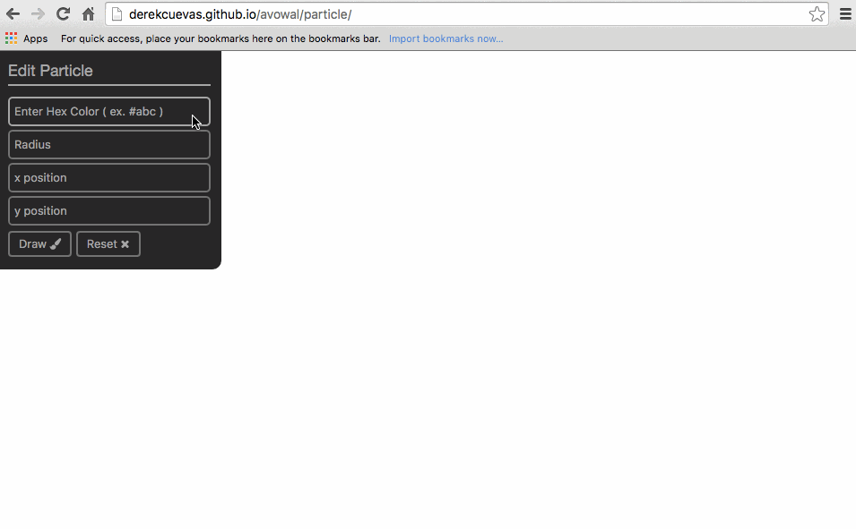

# Avowal
Super lightweight zero dependency asynchronous JavaScript form validation.

<!--
A lot of JavaScript form validation libraries aim to validate any and every possible set of input data. For example, all types of numeric and string input.

This library does not take that approach, rather it aims at separating common form based events (input, blur, change, submit, ...) from functions that validate input data along with functions to process side effects on that data.
-->

An arbitrary number of form inputs can be validated that require asynchronous validation (ex. AJAX) while avoiding race conditions and callback hell.

The API is 100% JS based, DOM attributes are **not** used to validate data. There is support for rendering validation messages against form inputs with templates (see examples).

Work in Progress (tests needed :scream:).

## Examples
Examples can be found in [/examples](/examples). There are three examples, an async example [/async](examples/async), a particle editor [/particle](examples/particle) and a sign up form [/signup](examples/signup). Only /async and /particle are published to gh-pages.



Go here: [http://derekcuevas.github.io/avowal/](http://derekcuevas.github.io/avowal/)

## Setup
`git clone` or `npm install` this repository.

```sh
git clone https://github.com/DerekCuevas/avowal.git
```

```sh
npm install --save avowal
```

Require with commonJS or include directly via a script tag.

```javascript
var Avowal = require('avowal');
```

```html
<script src="Avowal.js"></script>
```

**Or** use the latest version directly from [unpkg](https://unpkg.com)! (See examples published to gh-pages).

```html
<script src="https://unpkg.com/avowal"></script>
```

## Using it

Create an Avowal instance. It makes sense to name the instance the same as the form.

```javascript
var particle = new Avowal({

    // The name attribute of the form as specified by  
    // <form name='particle' ... ></form>.
    name: 'particle',

    // The validation event (common: 'input', 'blur', 'change', ...). Defaults
    // to 'input'.
    on: 'input',

    // 'Handlebars like' HTML templates to be rendered against each input.
    // Provide a wrapper DOM node with id of `${name}-status-message` (ex. id="color-status-message")
    // for the messages to be rendered into.
    //
    // Rendering is optional (see 'The lifecycle object').
    templates: {
        success: '<p class="success">{{message}}</p>',
        error: '<p class="error">{{message}}</p>',
    },
});
```

## Add a delegate

The delegate function accepts a specification object that describes the form and how to validate it. The specification object's top level keys map to input name attributes in the form.

```javascript
particle.delegate({
    color: {/* lifecycle object for the 'color' input */},
    radius: {/* lifecycle object for the 'radius' input */},
    ...
});
```

## The lifecycle object

Each input can specify a lifecycle object, the bare minimum lifecycle object will include the validate method only. Below is a bare minimum lifecycle object.

```javascript
color: {

    // The only required lifecycle method, 'validate' accepts two parameters,
    // the current value of the input and a callback function.
    //
    // The callback accepts two values, a boolean (valid / invalid) value and
    // a message to be rendered in one of your templates under the input.
    // If valid === true, the success template will be rendered. If valid === false
    // the error template will be rendered.
    //
    // Must return the state of the value with the callback as show below.
    // Rendering is optional, if a message is not supplied to the callback the
    // templates will not be rendered.
    validate: function (val, cb) {
        cb(true, 'The hex color looks valid.');
    },
}
```

A complete lifecycle object with all possible lifecycle events specified.

```javascript
color: {

    // Called just before any events are bound to the input,
    // the input DOM reference is passed in as an argument.
    init: function (input) {...},

    // The main validation function (documented above).
    validate: function (val, cb) {...},

    // Called whenever validate returns true.
    whenValid: function (val) {...},

    // Called whenever validate returns false.
    whenInvalid: function (val) {...},

    // Transforms the value to the returned value as the user types
    // fires on 'input' event.
    transform: function (val) {...}
}
```
## Top level API

Avowal
```javascript
/**
 * Constructor function
 *
 * required options:
 *     name (form name attribute)
 *
 * optional options:
 *     on (validation event),
 *     templates ('handlebars like' placeholder for form messages)
 *
 * @param {Object} options
 */
function Avowal(options) {...}
```

delegate
```javascript
/**
 * Delegates control of a form to the validator.
 *
 * The spec object's keys correspond to the name attributes
 * of the form's inputs. The values are the lifeCycle
 * objects for the matched inputs.
 *
 * Will throw if lifecycle object or inputs are invalid/not found.
 *
 * @param  {Object} spec {name: lifeCycle}
 */
Avowal.prototype.delegate = function (spec) {...}
```

reset
```javascript
/**
 * Resets the validation state of the form.
 * If clear is true the values in the form will also be cleared.
 *
 * @param {Boolean} clear
 */
Avowal.prototype.reset = function (clear) {...}
```

resetInput
```javascript
/**
 * Resets a given input's validation state.
 * If clear is true the value of the input will also be reset.
 *
 * @param {String} name (name attribute of input)
 * @param {Boolean} clear
 */
Avowal.prototype.resetInput = function (name, clear) {...}
```

isValid
```javascript
/**
 * Evaluates the current form state (**does not** execute the validate functions).
 *
 * @return {Boolean}
 */
Avowal.prototype.isValid = function () {...}
```

validateAll
```javascript
/**
 * Evaluates all form inputs, waits for all 'N' inputs to finish
 * validating before executing the callback. (**does** execute the validate functions)
 *
 * Returns the status through the callback function.
 *
 * @param  {Function} callback function (valid) {...}
 */
Avowal.prototype.validateAll = function (callback) {...}
```

on
```javascript
/**
 * Allows the setting of events on the form.
 * Wraps #addEventListener(), targets this.form.
 *
 * @param  {String} event
 * @param  {Function} callback
 */
Avowal.prototype.on = function (event, callback) {...}
```

getValues
```javascript
/**
 * Serializes the values in the form using the input cache.
 *
 * @return {Object} {name: value}
 */
Avowal.prototype.getValues = function () {...}
```

setValues
```javascript
/**
 * Updates the values in the form.
 *
 * If the validate flag is set to true the validate function will be executed against
 * any value changed in the form.
 *
 * @param {Object} values {name: value}
 * @param {Boolean} validate
 */
Avowal.prototype.setValues = function (values, validate) {...}
```

getState
```javascript
/**
 * Returns the current validation state.
 * @return {Object} {name: Boolean}
 */
Avowal.prototype.getState = function () {...}
```
